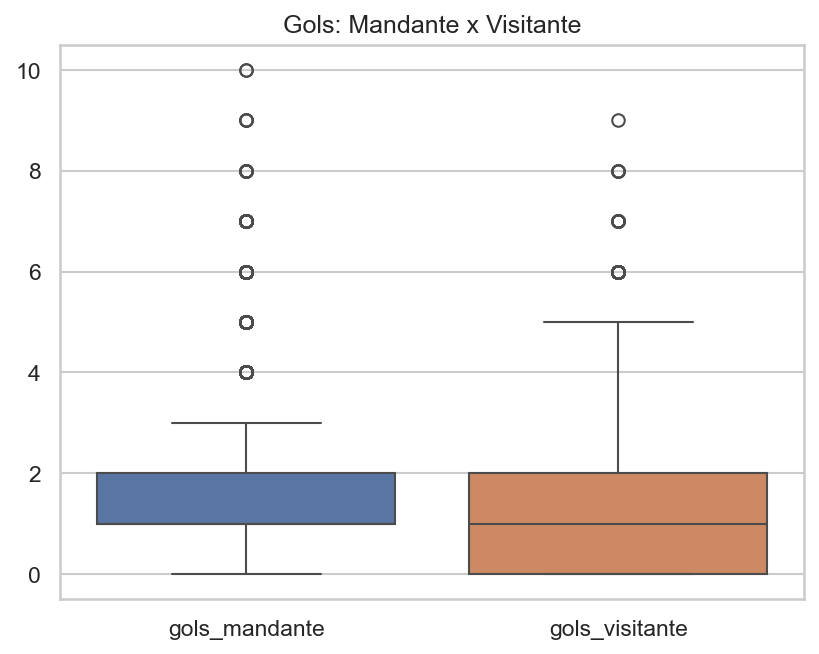
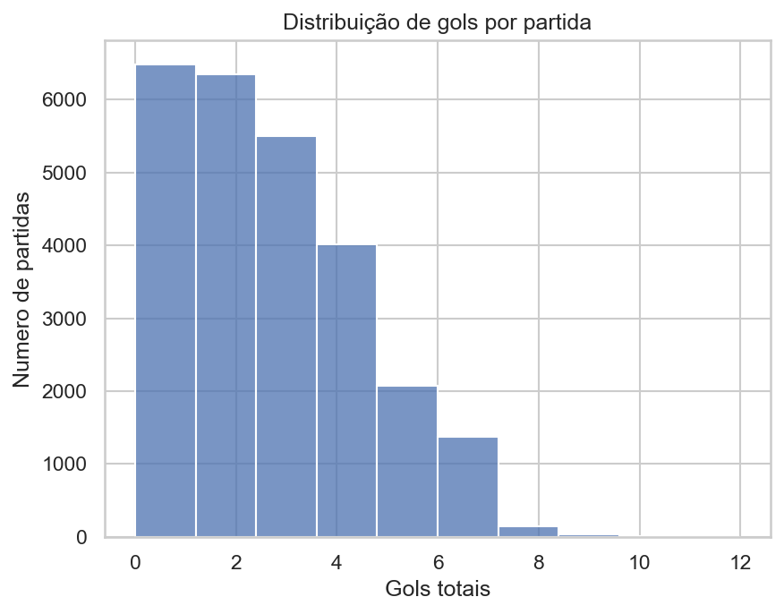
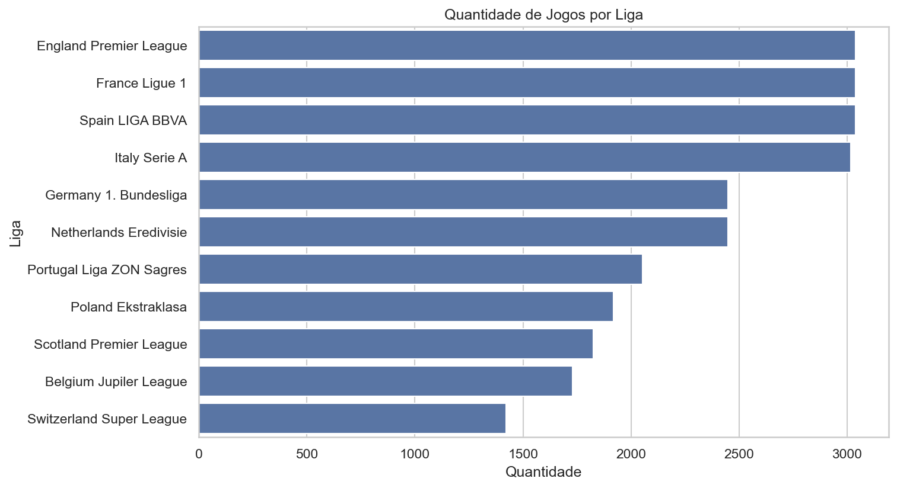
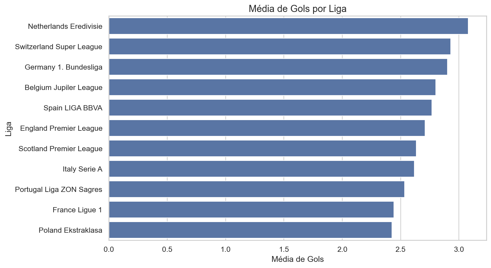
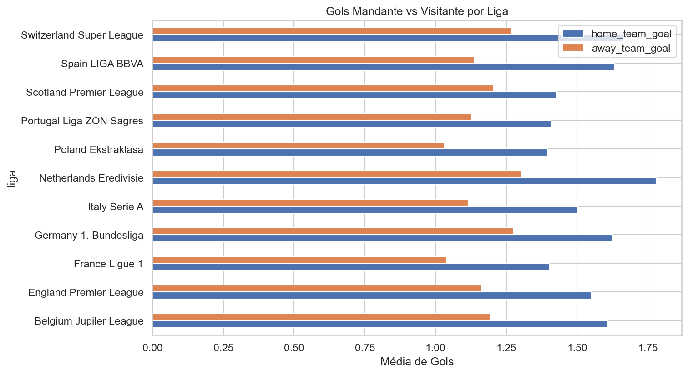
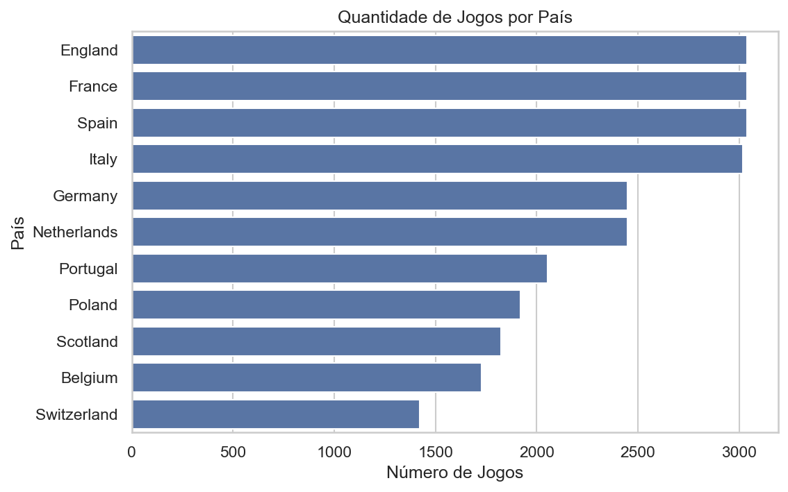
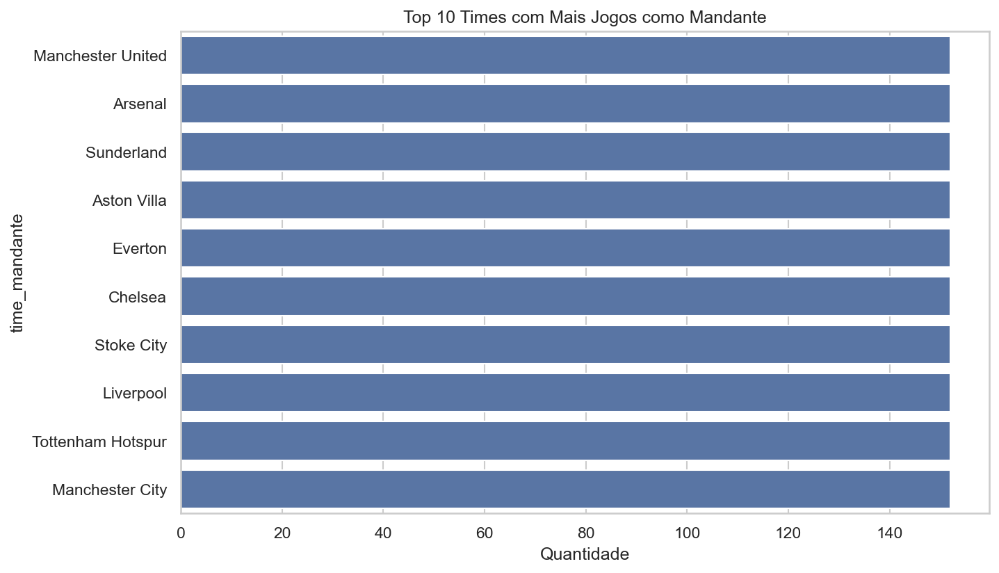
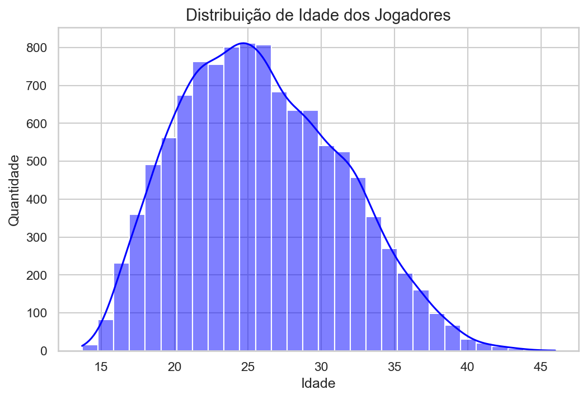
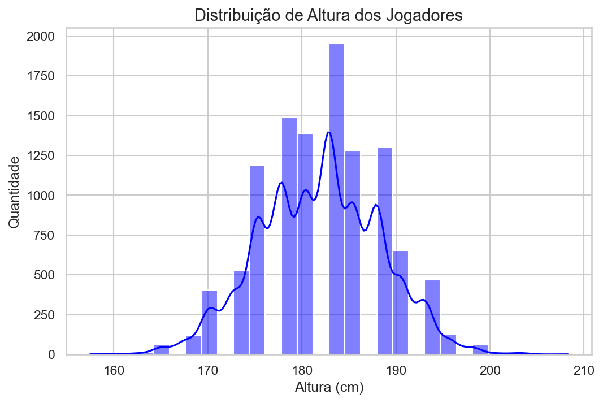
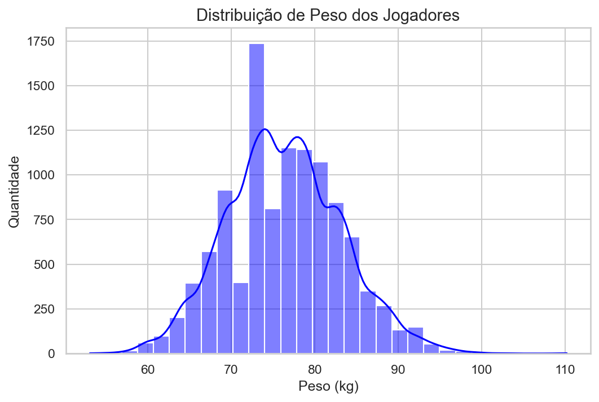

# ⚽ Análise de Dados — Futebol Europeu

> Projeto de Análise Exploratória de Dados (EDA) aplicado a um dataset de partidas de futebol europeu, com foco em identificar padrões de desempenho, vantagem do mandante, força ofensiva/defensiva dos times e perfil dos jogadores.

---

## 📌 Objetivo

Explorar os dados históricos de partidas de futebol europeu para responder perguntas como:

- Times mandantes têm vantagem real?
- Quais times marcam mais gols e sofrem menos?
- Como é o perfil físico e técnico dos jogadores?
- Quais habilidades mais influenciam a nota geral de um jogador?
- Como o desempenho dos times evoluiu ao longo das temporadas?

---

## 📁 Dataset

- **Fonte:** [Kaggle — European Soccer Database](https://www.kaggle.com/datasets/hugomathien/soccer)
- **Formato:** SQLite (`.sqlite`)
- **Tabelas analisadas:** `Match`, `Team`, `Player`, `Player_Attributes`
- **Período coberto:** Temporadas de futebol europeu de 2008 a 2016
- **Volume:** +25.000 partidas de diversas ligas europeias

---

## 📊 Principais Insights

### 🏠 Vantagem do mandante

Times que jogam em casa marcam em média mais gols que os visitantes, confirmando a vantagem de jogar em casa. Vitórias do mandante são o resultado mais comum, seguidas de vitórias do visitante e empates.



---

### ⚽ Distribuição de gols por partida

A maioria das partidas concentra entre 1 e 3 gols totais. A distribuição segue um padrão próximo ao de Poisson, típico de eventos raros acumulados.



---

### 🌍 Ligas e países

As ligas europeias apresentam volumes de jogos e médias de gols distintos. Algumas ligas são consistentemente mais ofensivas que outras.






---

### 🏆 Times como mandante

O ranking por jogos como mandante evidencia os times com maior presença em casa no período analisado.



---

### 👤 Perfil dos jogadores

A análise da tabela `Player` revela o perfil físico predominante na base — distribuição de idades, alturas e pesos dos jogadores registrados no período.





---

## 🔍 O que foi analisado

### Tabela Match
- Seleção das colunas relevantes e limpeza dos dados
- Distribuição de gols totais por partida
- Proporção de vitórias do mandante, visitante e empates
- Comparação da média de gols mandante vs visitante
- Média de gols por temporada (análise temporal)

### Tabela Team
- Top 10 times com mais jogos como mandante
- Ranking por saldo de gols como mandante
- Vitórias como mandante e como visitante
- Força ofensiva e defensiva por time

### Tabela Player
- Distribuição de idade, altura e peso dos jogadores

### Tabela Player_Attributes
- Distribuição da nota geral (`overall_rating`)
- Evolução da nota média ao longo dos anos
- Correlação entre habilidades (finalização, passe, drible) e nota geral
- Top 10 melhores jogadores por nota média
- Criação de rating médio por time com base nos jogadores

---

## 🛠️ Tecnologias utilizadas

| Ferramenta | Uso |
|---|---|
| Python 3 | Linguagem principal |
| Pandas | Manipulação e análise de dados |
| NumPy | Operações numéricas |
| Matplotlib | Visualizações gráficas |
| Seaborn | Gráficos estatísticos |
| SQLite3 | Conexão e consulta ao banco de dados |
| Jupyter Notebook | Ambiente de desenvolvimento |

---

## 📂 Estrutura do projeto

```
soccer-analysis/
│
├── assets/                                      # Imagens geradas pelo notebook
│   ├── distribuicao_gols_partida.png
│   ├── mandante_x_visitante.png
│   ├── distribuicao_quantidade_jogos_liga.png
│   ├── media_gols_liga.png
│   ├── mandante_x_visitante_liga.png
│   ├── jogos_pais.png
│   ├── top10_times_mandantes.png
│   ├── distribuicao_idade.png
│   ├── distribuicao_altura.png
│   └── distribuicao_peso.png
│
├── data/
│   └── database.sqlite                          # Base de dados original (Kaggle)
│
├── eda.ipynb                                    # Notebook com toda a análise exploratória
│
└── README.md                                    # Documentação do projeto
```

---

## 🚀 Roadmap do projeto

- [x] EDA da tabela `Match` — distribuição de gols, resultados e vantagem do mandante
- [x] Análise temporal — média de gols por temporada (2008–2016)
- [x] Análise por liga e país — volume de jogos e média de gols
- [x] Ranking de times — jogos como mandante e desempenho ofensivo/defensivo
- [x] EDA da tabela `Player` — perfil físico dos jogadores (idade, altura, peso)
- [x] EDA da tabela `Player_Attributes` — nota geral, evolução e correlação de habilidades
- [x] Criação de rating médio por time baseado nos jogadores
- [ ] Feature Engineering — criação de variáveis para machine learning
- [ ] Análise de forma recente dos times (últimos N jogos)
- [ ] Desenvolvimento de modelo preditivo de resultados

---

## 👤 Autor

Projeto desenvolvido como parte de formação prática em Ciência de Dados.

**Welington Fonseca**
[](https://github.com/kkwelington7-cpu)
