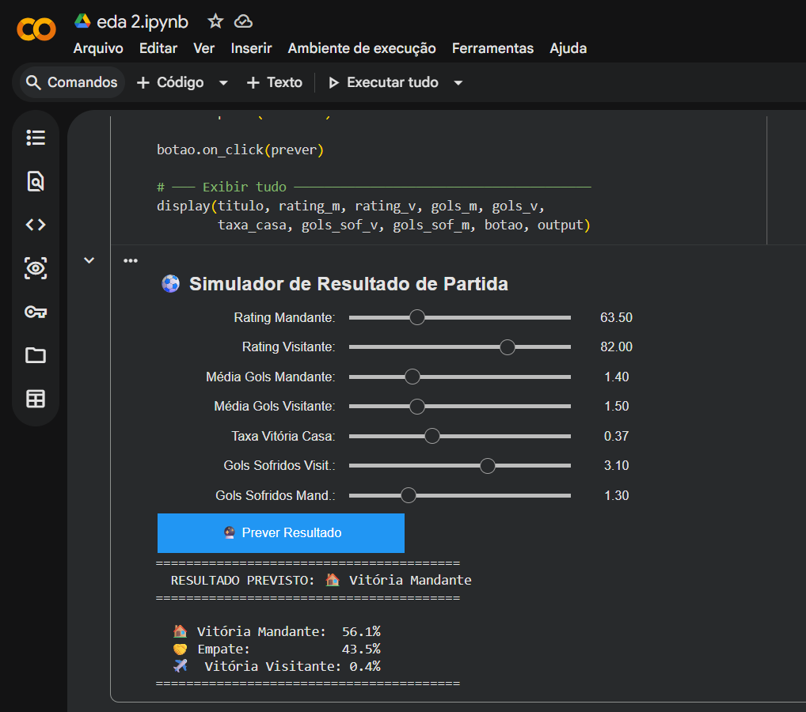

  Soccer Analysis  Previsão de Resultados de Partidas

Projeto completo de Data Science aplicado ao futebol europeu, cobrindo Análise Exploratória de Dados (EDA), Feature Engineering e Machine Learning para prever o resultado de partidas.

---

 Objetivo

Prever o resultado de uma partida de futebol (Vitória Mandante, Empate ou Vitória Visitante) com base em dados históricos de jogadores, times e partidas do **European Soccer Database**.

---

 Simulador Interativo

O projeto inclui um simulador onde é possível ajustar as características dos times e ver a previsão do modelo em tempo real, com as probabilidades para cada resultado.



---

 Estrutura do Projeto

```
soccer-analysis/
├── eda_2.ipynb          # Notebook principal (EDA + Feature Engineering + ML)
├── app.py               # Simulador interativo (ipywidgets)
├── models/
│   ├── modelo_final.pkl          # Modelo treinado salvo
│   └── features_utilizadas.pkl   # Features do modelo
├── assets/
│   ├── distribuicao_gols_partida.png
│   ├── mandante_x_visitante.png
│   ├── media_gols_liga.png
│   ├── importancia_features.png
│   └── ...
└── README.md
```

Fluxo do Projeto

```
Dados brutos (SQLite)
        ↓
  Análise Exploratória (EDA)
        ↓
  Feature Engineering
        ↓
  Treinamento e Avaliação de Modelos
        ↓
  Simulador Interativo
```

---

 Análise Exploratória 
Foram analisadas 6 tabelas do dataset: `Match`, `Team`, `Player`, `Player_Attributes`, `League` e `Country`.

**Principais descobertas:**

Times mandantes vencem em aproximadamente **45,8%** das partidas — vantagem clara de jogar em casa
A diferença de qualidade entre os elencos é o fator mais determinante do resultado
Empate é genuinamente imprevisível — ocorre em ~25% dos jogos sem padrão claro
Times ofensivos tendem a também ser bons defensivamente (correlação de -0.60)
Habilidades técnicas e ofensivas dos jogadores têm mais impacto no rating do que atributos físicos

---

Feature Engineering

Foram criadas 10 features a partir dos dados brutos:

| Feature | Descrição |
|---|---|
| `rating_mandante` | Rating médio dos jogadores do time da casa |
| `rating_visitante` | Rating médio dos jogadores do time visitante |
| `diff_rating` | Diferença de qualidade entre os elencos |
| `media_gols_mandante_recente` | Média de gols marcados nos últimos 5 jogos (mandante) |
| `media_gols_visitante_recente` | Média de gols marcados nos últimos 5 jogos (visitante) |
| `taxa_vitoria_casa_mandante` | Taxa histórica de vitórias em casa do mandante |
| `media_gols_sofridos_mandante` | Média de gols sofridos em casa (defesa do mandante) |
| `media_gols_sofridos_visitante` | Média de gols sofridos fora (defesa do visitante) |
| `diff_forma_recente` | Diferença de forma recente entre os times |
| `jogo_equilibrado` | Flag se a diferença de rating é menor que 0.5 |


---

Machine Learning

Problema: Classificação multiclasse (3 classes)

Desafio: Dataset desbalanceado — 45.8% vitória mandante, 28.8% vitória visitante, 25.4% empate

Modelos testados

| Modelo | Acurácia | Macro F1 |
|---|---|---|
| Baseline (chute majoritário) | 0.458 | — |
| Random Forest | 0.482 | 0.41 |
| Gradient Boosting | 0.521 | — |
| XGBoost | 0.484 | 0.46 |
| **Regressão Logística (balanceada)** | **0.489** | **0.47** |

Modelo escolhido: Regressão Logística com `class_weight='balanced'`

- Mais simples, mais rápido e melhor Macro F1
- Otimizado com `GridSearchCV` (5-fold cross-validation, scoring por F1 macro)

Resultado final

```
                   precision    recall  f1-score
Vitória Visitante       0.47      0.55      0.51
Empate                  0.30      0.31      0.30
Vitória Mandante        0.63      0.55      0.59
macro avg               0.47      0.47      0.47
```

Importância das features

A feature mais preditiva foi `diff_rating` (±0.38), confirmando que a diferença de qualidade entre os elencos é o principal fator de resultado — validando a hipótese levantada na EDA.

---

Principais Aprendizados

**Feature Engineering > Hiperparâmetros** — adicionar features novas melhorou mais o modelo do que otimizar configurações
**Modelos simples competem com complexos** — Regressão Logística superou Random Forest e XGBoost, indicando relação predominantemente linear entre features e resultado
**Desbalanceamento importa** — sem `class_weight='balanced'` o modelo ignorava completamente a classe Empate
**Futebol é imprevisível** — F1 de 0.30 para empate reflete a natureza do esporte, não falha do modelo

---

Tecnologias

  Python 3.12
  Pandas, NumPy
  Matplotlib, Seaborn
  Scikit-learn
  XGBoost
  SQLite3
  ipywidgets
  Google Colab

---

Dataset

[European Soccer Database — Kaggle](https://www.kaggle.com/datasets/hugomathien/soccer)

Contém mais de 25.000 partidas de 11 ligas europeias entre 2008 e 2016, com dados de jogadores, times e atributos detalhados.

---

 Autor

**Welington Fonseca**  
[GitHub](https://github.com/WelingtonFonseca)
